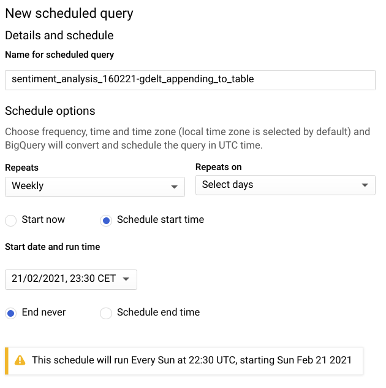
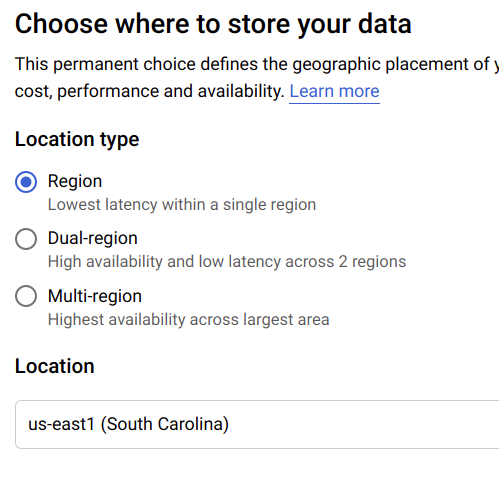

# Automated tailored Sentiment Analysis.

## Introduction.

Let's put Gdelt data within a Cloud Function to work. Let's compare my tailored Sentiment Analysis (in spanish) with the one provided by Gdelt, also with the NLTK Python library.

## Data Engineering behind.

 
Click to expand.

**BigQuery**:
The method consist of:
- 1st query: It takes all the wanted info from 2019-01-01 and creates a table. Available in *bigquery_sql/1nd_query_appending.sql*

This table will be requested, analyzed and processed. Results will be stored in a *results table*, and also in a Cloud Storage bucket.

- 2nd query: Will be triggered every sunday. Available in *bigquery_sql/2nd_query_appending.sql*
    - Overwriting weekly a table with the new data.
    - Also appending the new weekly info to the main table of 1st query (this is just a safety process in case I change the strategy along the project). 

**Cloud Function**:
Main strategy:
- Loads the available data in *2nd query* into a Cloud Storage bucket.
- Reads it, process it.
- Sends results to the Bucket.

Afraid of using too much RAM, I usually split this step into 2 different CF, 1 for loading into Storage and other to process the info. In this project maybe the amount of data is not that big and I can do both at once. Let's check it out.

**Transfer**:
- Takes the results and load it into the *results table* in BigQuery.

**Cloud Storage**:
Gdelt data is distributed in US servers. I think we need an US multi-region bucket, but let's try with a single-region one for the sake of costs and availability.

**Data Studio**
- Plots that table.

----------------------------

## Sentiment Analysis explanation.

 
Click to expand.

This is a leisure project in development and unfortunately I do not have all the time I want. I'll tell what I have in mind, and I'm quite sure it will change with time:

- I have a lot of urls that **Gdelt** tagged as *unemployment* related.
- I'm going to clean all that data, remove http protocols and leave just words.
- Use a ITF-TDF to remove redundant words.
- Generate a personal dictionary and score the found words.
- Group results by day.
- Plot sentiment evolution provided by Gdelt vs the one tailored by myself.

- Extra: Using the NLTK library and plot its performance too.

Let's see what I can get :D 

----------------------------

## Achivements.

 
Click to expand.

----------------------------

## Improvements.

 
Click to expand.

----------------------------

### About me:

 
Don't expand!.

- More Gdelt and ETL projects => https://github.com/albertovpd/analysing_world_news_with_Gdelt

- https://www.linkedin.com/in/alberto-vargas-pina/

